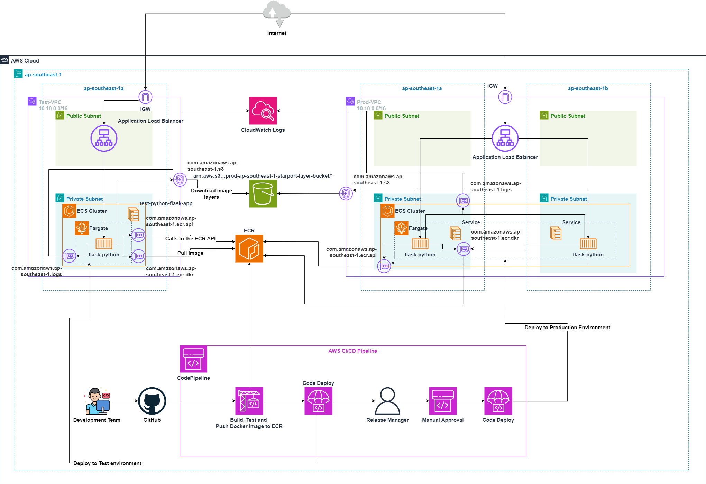

# DevOps Project  

## Overview
In this project, we will follow DevOps best practices to automate the processes of change management, building, testing, and deploying a Python Flask application on AWS. We will leverage the power of CI/CD tools and infrastructure on AWS to deploy our application. This will involve developing a Python Flask web application using Docker containers, automating the build and test process with Continuous Integration, automatically deploying to the test environment with Continuous Deployment, and approving deployments to the production environment through Continuous Deployment.

Our target architecture should look like below:

## Key Tools and Technologies
- ECS Fargate: Allows running containers without the need to manage servers or clusters of EC2 instances.
- ECR: Used for storing Docker images.
- CodeBuild: Defines a CodeBuild project to automate testing, building, and pushing Docker images to ECR.
- CodeDeploy: Enables deployment of the application to the appropriate environment, such as Test or Production.
- CodePipeline: Defines a CI/CD pipeline to automate the build and test process with Continuous Integration, automatically deploy to the test environment with Continuous Deployment, and approve deployments to the production environment through Continuous Deployment.
- VPC Gateway Endpoint for S3: Allows ECS tasks to pull private images from ECR via the AWS network backbone.
- VPC Interface Endpoint for ECR and CloudWatch Logs: Allows the Docker client to pull images and make calls to the ECR API (e.g., DescribeImages) over AWS's private network.

## Enhancements
- Observability: Tracks CodePipeline build status from GitHub and sets up Slack notifications for build failures.
- Infrastructure as Code: Utilizes IAC tools such as Terraform and CloudFormation to provision infrastructure, avoiding manual intervention.